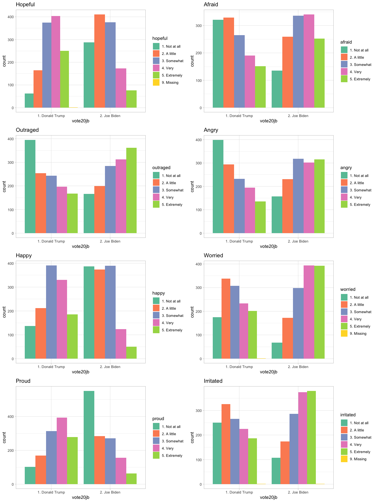

---
title: What Lies Behind Voters' Choice? 
  --- A Data-Question Story on the Pre-Election Survey
author: Yutong(April) Yang yy3116
date: Febuary 2, 2021
output:
  prettydoc::html_pretty:
    toc: true
    theme: caymen
---

# 1. Introduction
  The *American National Election Studies* (ANES) are surveys of voters in the U.S. on the national scale. For each presidential election since 1948, ANES collects responses from respondents both before and after the election. The goal of ANES is to understand political behaviors using systematic surveys. ANES's data and results have been routinely used by news outlets, election campaigns and political researchers.
  
<center>


</center>

  The *ANES 2020 Exploratory Testing Survey* was conducted for the purpose of **testing new questions and carrying out methodological research** to inform the design of the ANES 2020 Time Series study. As distinct from many ANES pilot surveys, the primary aim of the study was to allow for more targeted experimentation and testing of longer batteries of questions, with **less concern for estimation of population characteristics**. In line with these goals, the study relies on non-probability samples, and no sampling weights are provided. Therefore, the data might not be an ideal choice for making inferences about the distribution of opinions in the American electorate. Accesss more details [here](https://electionstudies.org/data-center/2020-exploratory-testing-survey/).

  Nevertheless, the data set still reveals valuable information as it reflects what American voters think when they are provided with a long series of questions. Besides, this being the only available ANES data for 2020 presidential election makes it relatively appropriate for understanding the voters' opinion and choice.

  Taking the factors above into account, the data is chosen as the primary target of analysis. The data collection was conducted between **April 10, 2020 and April 18, 2020**. The combined final sample includes responses from *3,080* adult citizens from across the United States.


```{r load libraries, warning=FALSE, message=FALSE, include=FALSE,echo=FALSE}
packages.used=as.list(
  c(
  "tidyverse",
  "haven",
  "devtools",
  "RColorBrewer",
  "data.table",
  "ggplot2",
  "reshape2",
  "corrplot",
  "matlab")
)

check.pkg = function(x){
  if(!require(x, character.only=T)) install.packages(x, 
                                                     character.only=T,
                                                     dependence=T)
}

lapply(packages.used, check.pkg)

df_init<-read_sav("../data/anes_pilot_2020ets_sav.sav")
df_init_c<-read.csv("../data/anes_pilot_2020ets_csv.csv")
df_emotion<-df_init[,c("hopeful","afraid","outraged","angry","happy","worried","proud","irritated","nervous","moneyorg","protest","online","persuade","vote20jb")]


```


# 2. Data Preprocessing
## 2.1: Missing Values and Data Types
  The first step of data cleaning is checking out on the missing values, after plotting out the missing values, only the variable *ethnic2* have missing values. Since the percentage of missing values is indeed small, only accounting for a tiny fraction of the data set, I directly dropped the missing values. 


```{r missing values, echo=FALSE}
library(DataExplorer)
plot_missing(df_init[,c(450:470)])
```


  Secondly, the data types can also be viewed using R. However, considering the huge amount of variables included in this data set, it would be wiser to directly reference the [codebook](https://electionstudies.org/anes_pilot_2020ets_codebook/).


## 2.2: Varaible selection with initial linear regression 


### **Question1: What factors have the highest correlation with the voters' choice?**


  This is actually the most fundamental as well as the most centered question for the whole study. To answer this core question and in the meantime conducting a variable selection process, I ran a linear regression on the data set to get a quick view of the key variables, using the *vote20jb* as the independent variable and omitting the text variables which contain description on the users' devices. The data set was split into a training set and a test set, with 80% of the original data as the training set. 
  
  
  
*ps. the variable vote20jb reflects the result of the question: "If the 2020 presidential election were between Donald Trump for the Republicans and Joe Biden for the Democrats, would you vote for Donald Trump, Joe Biden, someone else, or probably not vote?" Thus, it can be used to identify supporters of Donald Trump and Joe Biden.*


```{r}
# screen the variables
df_reg<-df_init[,c(11:470)]
# Partitioning; get 80% train set
splitPercent <- round(nrow(df_reg) %*% .8)
set.seed(1234)
idx      <- sample(1:nrow(df_reg), splitPercent)
trainSet <- df_reg[idx, ]
testSet  <- df_reg[-idx, ]
# fit the model
# lmfit <- lm(vote20jb ~ ., trainSet)
```


  The regression results shows that the following variables have the highest significance:
(Since the regression was ran on too may variables, I stored the results in a file.)


<center>


</center>

<center>


</center>


  Taking a quick glance at the table of variables, I found that variables whose name start with "pk" tend to be highly significant among all the variables. For example, the variable **"pk_cjusin kongers"** has the smallest p-value of 1.63E-27, **"pk_cjusno,idea"**'s p-value of 2.43E-08 ranks the third smallest among all variables. This indicates that the voters' political knowledge affect their choices on a relatively large scale.
  
  

  Besides, judging from the regression results, it was found that significant factors also lie in voters' emotions,  previous voting choices, ethnics and religions. The following questions for data analysis are therefore drawn out based on these observations.


## 2.3: Checking whether the data is balanced

Before we go on with looking further into the significant variables we retrieved from linear regression, we should first check whether the data is distributed in a balanced scale with respect to the key variables. Therefore, let's go over the sex, education and marital variables.

**sex** represents result of the question:
"What is your sex?"
1. Male
2. Female
    
    
```{r sex balance,echo=FALSE}
df_sex_vote<-df_init%>%filter(vote20jb %in% c("1. Donald Trump", "2. Joe Biden")) 
df_sex_vote<-df_init[,c("sex","vote20jb")]
df_sex_vote$vote20jb <- haven::as_factor(df_sex_vote$vote20jb)
df_sex_vote$sex <- haven::as_factor(df_sex_vote$sex)
df_sex_vote<-df_sex_vote%>%filter(vote20jb %in% c("1. Donald Trump", "2. Joe Biden")) 

ggplot(data=df_sex_vote)+
  geom_bar(mapping=aes(x=sex),width=0.5)

```

The plot indicates that the sample distribution of gender is overall balanced, with the number of females going a little higher than that of the males.

  
**marital1** represents result of the question:
"Are you now married, widowed, divorced, separated, or never married?"
1. Married
2. Widowed
3 Divorced
4. Separated
5. Never Married
    
    
```{r marital balance,echo=FALSE}

df_mari_vote<-df_init[,c("marital1","vote20jb")]
df_mari_vote$vote20jb <- haven::as_factor(df_mari_vote$vote20jb)
df_mari_vote$marital1 <- haven::as_factor(df_mari_vote$marital1)
df_mari_vote<-df_mari_vote%>%filter(vote20jb %in% c("1. Donald Trump", "2. Joe Biden")) 

ggplot(data=df_mari_vote)+
  geom_bar(mapping=aes(x=marital1),width=0.5)

summary(df_mari_vote$marital1)

```

The plot indicates that the a large proportion of the sample is married, the percentage of married sample is 1383/3080=44.9%, which is biased from the marital statistics accessed  [here](https://www.cdc.gov/nchs/nvss/marriage-divorce.htm?CDC_AA_refVal=https%3A%2F%2Fwww.cdc.gov%2Fnchs%2Fmardiv.htm).


    
**educ** represents result of the question:
"What is the highest level of school you have completed or the highest degree you have received?"
1. 12th grade or below, no high school diploma
2. High school graduate/diploma or equivalent
3. Some college but no degree
4. Associate degree
5. Bachelor’s degree
6. Master’s degree
7. Professional degree (e.g., MD, DDS, JD)
8. Doctorate


```{r educ balance, echo=FALSE}
df_edu_vote<-df_init_c[,c("educ","vote20jb")]
df_edu_vote$vote20jb <- haven::as_factor(df_edu_vote$vote20jb)
df_edu_vote$educ <- haven::as_factor(df_edu_vote$educ)
df_edu_vote<-df_edu_vote%>%filter(vote20jb %in% c("1", "2")) 

ggplot(data=df_edu_vote)+
  geom_bar(mapping=aes(x=educ),width=0.5)+ 
  scale_fill_brewer(palette="Set1")

# summary(df_edu_vote$educ)

```


The plot indicates that the the highest proportion of the sample has achieved a Bachelor's degree, while a large proportion of the sample has the education level of High school diploma or attended college but didn't achieved degree. The sample's opinion and view therefore reflects the attitude of a relatively well-educated section of people.

Based on the analysis of the general information of the data set, we may come to the conclusion that the sample of the data is imperfect, having bias in certain features. Therefore, we should always keep in mind that the following analysis might have flaws in accuracy and precision. However, since the results for the 2020 election has come out, we may also compare what the data reflects with the final fact. In this way, we may also take as a reference how this section of voters reflect the actual results.

# 3. Data Analysis

Having taken a look at the basic distribution of the data set, we may dig further into how the two sides of supporters differ in their basic personal backgrounds and status. 

Besides, combining the results of the initial linear regression, we may analyze factors such as race, emotion, political position and knowledge.

The following data analysis part will focus on how the two sides of voters differ in their gender, marital status, educational level, emotions, race and political backgrounds.

## 3.1 **Question2: How does gender affect voters' choice?** 

First let's plot out how different gender of people differ in their voting choices.


```{r plot for sex and vote choice, echo=FALSE}
df_sex_vote_t = df_sex_vote %>%
  group_by(vote20jb,sex) %>%
  summarise(
    n = n()
  ) 
ggplot(data = df_sex_vote_t, aes(x=sex, y=n, group = vote20jb)) +
  geom_col(aes(fill = vote20jb), position = "dodge") +
  scale_fill_brewer(palette="Set1") +
  geom_text(
    aes(label = n, y = n + 15),
    position = position_dodge(0.9),
    vjust = 0
  )
```

The plot between gender and voting choice shows that more females display a supportive attitude towards Joe Biden, while the males shows the opposite tendency. 

Considering the actual result that Biden has won the election, female voters might served as an important force for his success.

Since the questionnaire also included questions testing the voters' attitude on other political issues, we may wonder how the females on both sides hold their attitudes on the policies and the society.


###3.1.1: How females care about sexual harassment.

**harass** represents result of the question:
"Do you think attention to sexual harassment from the #MeToo movement has gone much too far, has gone a little too far, has been about right, has not gone quite far enough, or has not gone nearly far enough?"

The answers are:
--Gone much too far [1]
--Gone a little too far [2]
--Has been about right [3]
--Not gone quite far enough [4]
--Not gone nearly far enough [5]


```{r harass, echo=FALSE}
df_hara_vote<-df_init[,c("sex","harass","vote20jb")]
df_hara_vote$vote20jb <- haven::as_factor(df_hara_vote$vote20jb)
df_hara_vote$harass <- haven::as_factor(df_hara_vote$harass)
df_hara_vote$sex <- haven::as_factor(df_hara_vote$sex)
df_hara_vote<-df_hara_vote%>%filter(vote20jb %in% c("1. Donald Trump", "2. Joe Biden"))
df_hara_vote<-df_hara_vote%>%filter(sex=="2. Female")
df_hara_vote<-df_hara_vote%>%filter(harass!="9. Missing")
df_hara_vote<-df_hara_vote%>%filter(harass!="8. NA: Form 2")

df_hara_vote_t = df_hara_vote %>%
  group_by(vote20jb,harass) %>%
  summarise(
    n = n()
  ) 
ggplot(data = df_hara_vote_t, aes(x=harass, y=n, group = vote20jb)) +
  geom_col(aes(fill = vote20jb), position = "dodge") +
  scale_fill_brewer(palette="Set1") +
  geom_text(
    aes(label = n, y = n + 5),
    position = position_dodge(0.9),
    vjust = 0)+
  labs(title = "Females on both sides' attitude towards sexual harassment")
```

The result shows that Biden's female supporters are significantly more concerned about sexual harassment issues! In contrast, only a tiny fraction of females who support Trump show concern for this heated topic.

###3.1.2: How females care about free educaiton.

**harass** represents result of the question:
"Do you favor, oppose, or neither favor nor oppose guaranteeing free tuition at public colleges or universities for anyone admitted? The $79 billion per year cost would be paid for with higher taxes."

The answers are:
-- Favor a great deal [1] 
-- Favor a moderate amount [2] 
-- Favor a little [3] 
-- Neither favor nor oppose [4] 
-- Oppose a little [5] 
-- Oppose a moderate amount [6] 
-- Oppose a great deal [7]

```{r freecol1, echo=FALSE}
df_fcol_vote<-df_init[,c("sex","freecol1","vote20jb")]
df_fcol_vote$vote20jb <- haven::as_factor(df_fcol_vote$vote20jb)
df_fcol_vote$freecol1 <- haven::as_factor(df_fcol_vote$freecol1)
df_fcol_vote$sex <- haven::as_factor(df_fcol_vote$sex)
df_fcol_vote<-df_fcol_vote%>%filter(vote20jb %in% c("1. Donald Trump", "2. Joe Biden"))
df_fcol_vote<-df_fcol_vote%>%filter(sex=="2. Female")
df_fcol_vote<-df_fcol_vote%>%filter(freecol1!="88. NA: Form 2")

df_fcol_vote_t = df_fcol_vote %>%
  group_by(vote20jb,freecol1) %>%
  summarise(
    n = n()
  ) 
ggplot(data = df_fcol_vote_t, aes(x=freecol1, y=n, group = vote20jb)) +
  geom_col(aes(fill = vote20jb), position = "dodge") +
  scale_fill_brewer(palette="Set1") +
  geom_text(
    aes(label = n, y = n + 5),
    position = position_dodge(0.9),
    vjust = 0) +
  labs(title = "Females on both sides' attitude towards free education")
```

The result again shows a huge distinction between the two group of females! Trump's supporters are strongly opposed to sacrifice their taxes for free college education.

The above analysis indicates that females who support Trump seem to care more about their personal benefits, but tend to be conservative when it comes to guarding females' actual rights. This might not be helpful to Trump, since this group of people would place more attention on their personal economic benefits. Under the pandemic situation, Trump's policy undoubtedly has added to the financial loss of general public. Thus, it is likely that he would be losing support from this group of people.


## 3.2 **Question3: How does marital status affect voters' choice?** 

Since a large proportion of the sample are married, let's go on to see how marital status would affect voters' voting choices.

```{r plot for marital status and vote choice, echo=FALSE}
df_mari_vote_t = df_mari_vote %>%
  group_by(vote20jb,marital1) %>%
  summarise(
    n = n()
  ) 
ggplot(data = df_mari_vote_t, aes(x=marital1, y=n, group = vote20jb)) +
  geom_col(aes(fill = vote20jb), position = "dodge") +
  scale_fill_brewer(palette="Pastel1") +
  geom_text(
    aes(label = n, y = n + 15),
    position = position_dodge(0.9),
    vjust = 0) +
  labs(title = "Marital Status and Voters' Choice")
```


The result shows that a larger proportion of married people would choose to support Trump, while people who divorced or have never been married tend to support Joe Biden. This is explainable since Biden's supporters are younger on average.


## 3.3 **Question4: How does educational level affect voters' choice?** 

The relationship between educational level and people's political stances has always been an interesting topic. Here we can also take a quick glance from this prospective.

```{r plot for educational status and vote choice, echo=FALSE}
df_edu_vote_t = df_edu_vote %>%
  group_by(vote20jb,educ) %>%
  summarise(
    n = n()
  ) 
ggplot(data = df_edu_vote_t, aes(x=educ, y=n, group = vote20jb)) +
  geom_col(aes(fill = vote20jb), position = "dodge") +
  scale_fill_brewer(palette="Pastel2") +
  geom_text(
    aes(label = n, y = n + 10),
    position = position_dodge(0.9),
    vjust = 0) +
  labs(title = "Education and Voters' Choice")
```


Here category "1" represents supporters for Trump, "2" for the other. We can see that both sides of voters have a relatively balanced distribution across the educational groups, with Biden's supporters outperforms a little.


## 3.4 **Question5: What emotions are held by supporters for Trump and Biden?**
  Taking the fact that variables depicting voters' emotions are relatively significant in the regression result, I went on to explore what different emotions the two group of people might have. 

  First of all, a correlation plot is drawn to visualize how different kinds of emotions are correlated with the voters' choices.

```{r corrplot, echo=FALSE}
mat <- round(cor(df_emotion), 1)
par(pin=c(9,9))
color<-colorRampPalette(c(brewer.pal(7,"Set1")[2],"white",brewer.pal(7,"Set1")[1]))(100)
corrplot.mixed(mat,order ="alphabet",pch.col = "black",bg = "grey80", lower.col = color, upper.col = color)
```

From the plot, we can observe that the "Hopeful" and "Proud" emotions have the highest absolute value of correlation coefficients with voters' choices. To examine the relationship in detail, let's see the distribution of emotions within the two groups.
The following chart is plotted based on voters' response in the question:
"Generally speaking, how do you feel about the way things are going in the country these days?"


<center>



</center>


  From the distribution of the emotions, we can see that Trump's supporters display an overall positive emotion, while Biden's supporters show negative emotional status. Biden's supporters tend to be more **angry, worried, afraid, irritated and outraged** towards the country's current situation, which is a reasonable phenomenon since it indicates their dissatisfaction on Trump's political "feat", thus they are more likely to vote for a new candidate of president.


## 3.5 **Question6: How do supporters of Trump and Biden differ in their ethnicity?**
 
The regression result shows that variables such as **'asians_4'** and **'ethnic2Italian American'** are significant to the voters' choice. Does ethnicity really contribute a lot to the variations of the voters' choices? 
 
Let's plot out the result of the questions:"Please choose one or more races that you consider yourself to be." to test this assumption.
 
 
 <center>


</center>


  The plot shows difference races' different electoral choices. For instance, it is clear that a larger proportion of whites tend to vote for Donald Trump, while Joe Biden received more support from voters of other race groups.
  
  Given the difference of both parties of voters' emotions and ethnicity, one may further consider how different race of people hold their emotions. Let's see the radar chart of the emotional score of different race of people. The emotional scores are standardized using the scale() function to avoid the effect of the size of race samples. Since the sample sizes for American Indians, Alaskan Natives and Hawaiians and Pacific Islanders are too small, we will mainly focus on the group of whites, blacks, asians and hispanics.
  
  
```{r race, echo=FALSE,warning=FALSE, message=FALSE, include=FALSE}
###  race
df_race<-df_init[,c("race1_white","race1_black","race1_namer","race1_asian","race1_hpi","vote20jb")]
df_hisp<-df_init_c[,c("latin1","vote20jb")]

df_race1<-df_race%>%mutate( Ethnicity = case_when(race1_white == 1 ~ 'White',
                                              race1_black == 1 ~ 'Black',
                                              race1_asian == 1 ~ 'Asian',
                                              race1_namer == 1 ~ 'American Indian or Alaskan Native',
                                              TRUE ~ 'Native Hawaiian or other Pacific Islander'))
df_race1<-df_race1%>%mutate( VotingChoice = case_when(vote20jb == 1 ~ 'Donald Trump',
                                                  vote20jb == 2 ~ 'Joe Biden',
                                                  vote20jb == 3 ~ 'Someone else',
                                                  TRUE ~ 'Probably not vote'))


######draw radar chart on different races of people and their different emotions
##radar setting prepare
coord_radar <- function (theta = "x", start = 0, direction = 1) 
{  theta <- match.arg(theta, c("x", "y"))
r <- if (theta == "x") 
  "y"
else "x"
ggproto("CoordRadar", CoordPolar, theta = theta, r = r, start = start, 
        direction = sign(direction),
        is_linear = function(coord) TRUE)}

# emotions
df_raceemo<-df_init[,c("latin1","race1_white","race1_black","race1_namer","race1_asian","race1_hpi",
                       "hopeful","afraid","outraged","angry","happy","worried","proud",
                       "irritated","vote20jb")]
# hispanics
df_hispemo<-df_raceemo%>%filter(latin1==1)
df_hispemo<-df_hispemo[,c("hopeful","afraid","outraged","angry","happy","worried","proud",
                                              "irritated","vote20jb")]
emotion_trump<-df_hispemo%>%filter(vote20jb==1)
emotion_biden<-df_hispemo%>%filter(vote20jb==2)
count_emotrump<-scale(colSums(emotion_trump[,c("hopeful","afraid","outraged","angry","happy","worried","proud","irritated")]))
count_emobiden<-scale(colSums(emotion_biden[,c("hopeful","afraid","outraged","angry","happy","worried","proud","irritated")]))
# plot radar chart
label_data<-data.frame(
  car=c("hopeful" , "afraid" ,"outraged" ,  "angry" , "happy" , "worried","proud", "irritated"),
  id=c(1:8) ,
  DonaldTrump=count_emotrump,
  JoeBiden=count_emobiden
)
AddRow<-c(NA,nrow(label_data)+1,label_data[1,ncol(label_data)-1],label_data[1,ncol(label_data)])
mydata<-rbind(label_data,AddRow)
myAngle<- 360- 360 * (label_data$id-1) /nrow(label_data)  
mydata<-melt(mydata,id=c("car", "id"))
g1<-ggplot(data=mydata,aes(x=id, y=value,group=variable,fill=variable)) + 
  geom_polygon(colour="black",alpha=0.1)+
  geom_point(size=4,shape=21,color = 'black')+
  coord_radar()+
  labs(title="Radar Chart of the Hispanics' Emotions")+
  #coord_polar() +
  scale_x_continuous(breaks =label_data$id,labels=label_data$car)+
  theme_bw() +
  ylim(-2,2)+
  theme(axis.text.x=element_text(size = 11,colour="black",angle = myAngle),
        axis.title=element_text(size=15,face="plain",color="black"),
        axis.text = element_text(size=12,face="plain",color="black"),
        panel.grid.major = element_line(color="grey80"),
        axis.line = element_line(color="black"),
        axis.ticks =  element_line(color="black"))


# whites
df_hispemo<-df_raceemo%>%filter(race1_white==1)
df_hispemo<-df_hispemo[,c("hopeful","afraid","outraged","angry","happy","worried","proud",
                          "irritated","vote20jb")]
emotion_trump<-df_hispemo%>%filter(vote20jb==1)
emotion_biden<-df_hispemo%>%filter(vote20jb==2)
count_emotrump<-scale(colSums(emotion_trump[,c("hopeful","afraid","outraged","angry","happy","worried","proud","irritated")]))
count_emobiden<-scale(colSums(emotion_biden[,c("hopeful","afraid","outraged","angry","happy","worried","proud","irritated")]))
# plot radar chart
label_data<-data.frame(
  car=c("hopeful" , "afraid" ,"outraged" ,  "angry" , "happy" , "worried","proud", "irritated"),
  id=c(1:8) ,
  DonaldTrump=count_emotrump,
  JoeBiden=count_emobiden
)
AddRow<-c(NA,nrow(label_data)+1,label_data[1,ncol(label_data)-1],label_data[1,ncol(label_data)])
mydata<-rbind(label_data,AddRow)
myAngle<- 360- 360 * (label_data$id-1) /nrow(label_data)  
mydata<-melt(mydata,id=c("car", "id"))
g2<-ggplot(data=mydata,aes(x=id, y=value,group=variable,fill=variable)) + 
  geom_polygon(colour="black",alpha=0.1)+
  geom_point(size=4,shape=21,color = 'black')+
  coord_radar()+
  labs(title="Radar Chart of the Whites' Emotions")+
  #coord_polar() +
  scale_x_continuous(breaks =label_data$id,labels=label_data$car)+
  theme_bw() +
  ylim(-2,2)+
  theme(axis.text.x=element_text(size = 11,colour="black",angle = myAngle),
        axis.title=element_text(size=15,face="plain",color="black"),
        axis.text = element_text(size=12,face="plain",color="black"),
        panel.grid.major = element_line(color="grey80"),
        axis.line = element_line(color="black"),
        axis.ticks =  element_line(color="black"))


# asians
df_hispemo<-df_raceemo%>%filter(race1_asian==1)
df_hispemo<-df_hispemo[,c("hopeful","afraid","outraged","angry","happy","worried","proud",
                          "irritated","vote20jb")]
emotion_trump<-df_hispemo%>%filter(vote20jb==1)
emotion_biden<-df_hispemo%>%filter(vote20jb==2)
count_emotrump<-scale(colSums(emotion_trump[,c("hopeful","afraid","outraged","angry","happy","worried","proud","irritated")]))
count_emobiden<-scale(colSums(emotion_biden[,c("hopeful","afraid","outraged","angry","happy","worried","proud","irritated")]))
# plot radar chart
label_data<-data.frame(
  car=c("hopeful" , "afraid" ,"outraged" ,  "angry" , "happy" , "worried","proud", "irritated"),
  id=c(1:8) ,
  DonaldTrump=count_emotrump,
  JoeBiden=count_emobiden
)
AddRow<-c(NA,nrow(label_data)+1,label_data[1,ncol(label_data)-1],label_data[1,ncol(label_data)])
mydata<-rbind(label_data,AddRow)
myAngle<- 360- 360 * (label_data$id-1) /nrow(label_data)  
mydata<-melt(mydata,id=c("car", "id"))
g3<-ggplot(data=mydata,aes(x=id, y=value,group=variable,fill=variable)) + 
  geom_polygon(colour="black",alpha=0.1)+
  geom_point(size=4,shape=21,color = 'black')+
  coord_radar()+
  labs(title="Radar Chart of the Asians' Emotions")+
  #coord_polar() +
  scale_x_continuous(breaks =label_data$id,labels=label_data$car)+
  theme_bw() +
  ylim(-2,2)+
  theme(axis.text.x=element_text(size = 11,colour="black",angle = myAngle),
        axis.title=element_text(size=15,face="plain",color="black"),
        axis.text = element_text(size=12,face="plain",color="black"),
        panel.grid.major = element_line(color="grey80"),
        axis.line = element_line(color="black"),
        axis.ticks =  element_line(color="black"))

# blacks
df_hispemo<-df_raceemo%>%filter(race1_black==1)
df_hispemo<-df_hispemo[,c("hopeful","afraid","outraged","angry","happy","worried","proud",
                          "irritated","vote20jb")]
emotion_trump<-df_hispemo%>%filter(vote20jb==1)
emotion_biden<-df_hispemo%>%filter(vote20jb==2)
count_emotrump<-scale(colSums(emotion_trump[,c("hopeful","afraid","outraged","angry","happy","worried","proud","irritated")]))
count_emobiden<-scale(colSums(emotion_biden[,c("hopeful","afraid","outraged","angry","happy","worried","proud","irritated")]))
# plot radar chart
label_data<-data.frame(
  car=c("hopeful" , "afraid" ,"outraged" ,  "angry" , "happy" , "worried","proud", "irritated"),
  id=c(1:8) ,
  DonaldTrump=count_emotrump,
  JoeBiden=count_emobiden
)
AddRow<-c(NA,nrow(label_data)+1,label_data[1,ncol(label_data)-1],label_data[1,ncol(label_data)])
mydata<-rbind(label_data,AddRow)
myAngle<- 360- 360 * (label_data$id-1) /nrow(label_data)  
mydata<-melt(mydata,id=c("car", "id"))
g4<-ggplot(data=mydata,aes(x=id, y=value,group=variable,fill=variable)) + 
  geom_polygon(colour="black",alpha=0.1)+
  geom_point(size=4,shape=21,color = 'black')+
  coord_radar()+
  labs(title="Radar Chart of the Blacks' Emotions")+
  #coord_polar() +
  scale_x_continuous(breaks =label_data$id,labels=label_data$car)+
  theme_bw() +
  ylim(-2,2)+
  theme(axis.text.x=element_text(size = 11,colour="black",angle = myAngle),
        axis.title=element_text(size=15,face="plain",color="black"),
        axis.text = element_text(size=12,face="plain",color="black"),
        panel.grid.major = element_line(color="grey80"),
        axis.line = element_line(color="black"),
        axis.ticks =  element_line(color="black"))

# namer
df_hispemo<-df_raceemo%>%filter(race1_namer==1)
df_hispemo<-df_hispemo[,c("hopeful","afraid","outraged","angry","happy","worried","proud",
                          "irritated","vote20jb")]
emotion_trump<-df_hispemo%>%filter(vote20jb==1)
emotion_biden<-df_hispemo%>%filter(vote20jb==2)
count_emotrump<-scale(colSums(emotion_trump[,c("hopeful","afraid","outraged","angry","happy","worried","proud","irritated")]))
count_emobiden<-scale(colSums(emotion_biden[,c("hopeful","afraid","outraged","angry","happy","worried","proud","irritated")]))
# plot radar chart
label_data<-data.frame(
  car=c("hopeful" , "afraid" ,"outraged" ,  "angry" , "happy" , "worried","proud", "irritated"),
  id=c(1:8) ,
  DonaldTrump=count_emotrump,
  JoeBiden=count_emobiden
)
AddRow<-c(NA,nrow(label_data)+1,label_data[1,ncol(label_data)-1],label_data[1,ncol(label_data)])
mydata<-rbind(label_data,AddRow)
myAngle<- 360- 360 * (label_data$id-1) /nrow(label_data)  
mydata<-melt(mydata,id=c("car", "id"))
g5<-ggplot(data=mydata,aes(x=id, y=value,group=variable,fill=variable)) + 
  geom_polygon(colour="black",alpha=0.1)+
  geom_point(size=4,shape=21,color = 'black')+
  coord_radar()+
  labs(title="Radar Chart of the Native Americans' Emotions")+
  #coord_polar() +
  scale_x_continuous(breaks =label_data$id,labels=label_data$car)+
  theme_bw() +
  ylim(-2,2)+
  theme(axis.text.x=element_text(size = 11,colour="black",angle = myAngle),
        axis.title=element_text(size=15,face="plain",color="black"),
        axis.text = element_text(size=12,face="plain",color="black"),
        panel.grid.major = element_line(color="grey80"),
        axis.line = element_line(color="black"),
        axis.ticks =  element_line(color="black"))

# native hawaiian or pacific islanders
df_hispemo<-df_raceemo%>%filter(race1_hpi==1)
df_hispemo<-df_hispemo[,c("hopeful","afraid","outraged","angry","happy","worried","proud",
                          "irritated","vote20jb")]
emotion_trump<-df_hispemo%>%filter(vote20jb==1)
emotion_biden<-df_hispemo%>%filter(vote20jb==2)
count_emotrump<-scale(colSums(emotion_trump[,c("hopeful","afraid","outraged","angry","happy","worried","proud","irritated")]))
count_emobiden<-scale(colSums(emotion_biden[,c("hopeful","afraid","outraged","angry","happy","worried","proud","irritated")]))
# plot radar chart
label_data<-data.frame(
  car=c("hopeful" , "afraid" ,"outraged" ,  "angry" , "happy" , "worried","proud", "irritated"),
  id=c(1:8) ,
  DonaldTrump=count_emotrump,
  JoeBiden=count_emobiden
)
AddRow<-c(NA,nrow(label_data)+1,label_data[1,ncol(label_data)-1],label_data[1,ncol(label_data)])
mydata<-rbind(label_data,AddRow)
myAngle<- 360- 360 * (label_data$id-1) /nrow(label_data)  
mydata<-melt(mydata,id=c("car", "id"))
g6<-ggplot(data=mydata,aes(x=id, y=value,group=variable,fill=variable)) + 
  geom_polygon(colour="black",alpha=0.1)+
  geom_point(size=4,shape=21,color = 'black')+
  coord_radar()+
  labs(title="Radar Chart of the Native Hawaiian or Pacific Islanders' Emotions")+
  #coord_polar() +
  scale_x_continuous(breaks =label_data$id,labels=label_data$car)+
  theme_bw() +
  ylim(-2,2)+
  theme(axis.text.x=element_text(size = 11,colour="black",angle = myAngle),
        axis.title=element_text(size=15,face="plain",color="black"),
        axis.text = element_text(size=12,face="plain",color="black"),
        panel.grid.major = element_line(color="grey80"),
        axis.line = element_line(color="black"),
        axis.ticks =  element_line(color="black"))

library(gridExtra)
grid.arrange(g1,g2,g3,g4,nrow=2,ncol=2)
```

 <center>


</center>
  
  
  
  From the plot we observe some interesting facts:
  
  1. Among Trump's supporters, the Asians shows the lowest score of being hopeful, while the blacks show the lowest score of being happy. Overall, this section of Asians and the Blacks, though supporting Trump, still display a higher level of negative emotions. 
  
  2. Among Biden's supporters, the emotions seem to be distributed in a relatively fair proportion among different races.
  
  
  
## 3.6 **Question7: How do supporters of Trump and Biden differ in their voting history or other choices?**
  How voters act under different circumstances reveals the voters' political attitude. Therefore, by drawing a Sankey plot which shows how supporters of Trump and Biden act differently in other voting situations, some insights on how the two group of people can be retrieved.
  
  **Turnout16a** represents result of the question:
  "In 2016, the major candidates for president were Donald Trump for the Republicans and Hillary Clinton for the Democrats. In that election, did you definitely vote, definitely not vote, or are you not completely sure whether you voted?";
  -- Definitely voted [1]
  -- Definitely did not vote [2]
  -- Not completely sure [3]
  
  **Vote20bs** represents result of the question:
  "If the 2020 presidential election were between Donald Trump for the Republicans and Bernie Sanders for the Democrats, would you vote for Donald Trump, Bernie Sanders, someone else, or probably not vote?";
  -- Donald Trump [1]
  -- Bernie Sanders [2]
  -- Someone else [3]
  -- Probably not vote [4]
  
  **Cvote2020** represents result of the question:
  "If the election for the U.S. House of Representatives were being held today, and you had to make a choice, would you be voting for the Republican candidate or the Democrat candidate in your district?"
  -- Democrat [1]
  -- Republican [2]
  -- Other [3]
  -- Won’t vote [4]
  -- Don’t know [5]


<center>


</center>


  From the Sankey plot, it can be seen that supporters from the two groups do show some distinctions. For example, it seems that nearly all of Trump's supporters definitely voted in the 2016 election, while more than half of Biden's supporters didn't. When faced with the selection between Sanders and Trump, a small fraction of Biden's supporters would rather choose not to vote for someone else, but Trump's supporters are more firm-minded.
  
  
  
  
  

 

 
## 3.7 **Question8: What do supporters of Trump and Biden differ in their economic circumstances?**
  Many previous study have researched on the voters' economic background and attitudes have influence on their political choices. For example, Likhitha Butchireddygari put forward that [Voters Who Think The Economy Is The Country’s Biggest Problem Are Pretty Trumpy. That Might Not Help Him Much.](https://fivethirtyeight.com/features/voters-who-think-the-economy-is-the-countrys-biggest-problem-are-pretty-trumpy-that-might-not-help-him-much/).
  How are voters' choices correlated with their economic choices and what are other factors that contributes to the variations in economic stances? Let's take a look at some variables that can be used for analysis.
  
  
  **finworry** represents result of the question:
  "So far as you and your family are concerned, how worried are you about your current financial situation?"  
  Thus, it can be used to evaluate the voter's economic status as a reference. To be specific, we can consider people who are "Not at all worried" about their financial situation as relatively affluent.
  
  
```{r set df econ, echo=FALSE}
df_econ<-df_init[,c("finworry","wall7","covid1","covid2","vote20jb")]
library(haven)
library(ggplot2)
# Convert labelled vector to a factor
df_econ$covid1 <- haven::as_factor(df_econ$covid1)
df_econ$covid2 <- haven::as_factor(df_econ$covid2)
df_econ$vote20jb<- haven::as_factor(df_econ$vote20jb)
df_econ$finworry<- haven::as_factor(df_econ$finworry)
df_econ$wall7<- haven::as_factor(df_econ$wall7)
```
  
  


```{r fin choice, echo=FALSE}
d1<-df_econ %>%
 filter(!(finworry %in% "9. Missing")) %>%
 filter(!(wall7 %in% "9. Missing")) %>%
 
    filter(!(covid1 %in% "9. Missing")) %>%
 filter(!(covid2 %in% "9. Missing")) %>%
 
    filter(vote20jb %in% c("1. Donald Trump", "2. Joe Biden")) %>%
 ggplot() +
 aes(x = finworry, fill = vote20jb) +
 geom_bar(width = 0.6) +
 scale_fill_brewer(palette = "Paired") +
 labs(title = "Financial status & Voting choice") +
 coord_flip() +
 theme_minimal()

d2<-df_econ %>%
 filter(!(finworry %in% "9. Missing")) %>%
 filter(!(wall7 %in% "9. Missing")) %>%
 
    filter(!(covid1 %in% "9. Missing")) %>%
 filter(!(covid2 %in% "9. Missing")) %>%
 
    filter(vote20jb %in% c("1. Donald Trump", "2. Joe Biden")) %>%
 ggplot() +
 aes(x = vote20jb, fill = finworry) +
 geom_bar(width=0.5) +
 scale_fill_brewer(palette = "Paired") +
 labs(title = "Financial status & Voting choice") +
 coord_flip() +
 theme_minimal()


library(gridExtra)
grid.arrange(d1,d2,nrow=2,ncol=1)


```
  
  If we plot out the voting choice of people from different financial backgrounds, many previous studies' assumption that one's political choice is correlated with his/her economic status can be validated. It is obvious that a greater proportion of wealthy people have a tendency towards voting for Trump, while Biden's supporters have more diverdified finantial status.


  Now let's go on to see how people from different economic backgrounds differ in their political choices and attitudes.
  
  First let's take a glance at the variables that can be used for this part of analysis.
  
   **wall7** represents result of the question:
  "Do you favor, oppose, or neither favor nor oppose building a wall on the U.S. border with Mexico?"  
  Thus, this variable can evaluate a voter's attitude on Trump's immigration policies.
  
  **covid1** represents result of the question:
  "How worried are you personally about getting the coronavirus (COVID-19)?"  
  Therefore, this variable reveals the extent to which a voter is concerned about the COVID situation.

  **covid2** represents result of the question:
  "How worried are you about the economic impact of the coronavirus?"  
  Therefore, this variable is correlated with a voter's economic attitude on the COVID situation.
  
  
  Having the above knowledge, we may go on to discover the relationship of voters' finanical status and the factors.

  
```{r fin covid, echo= FALSE}
g1<-df_econ %>%
 filter(!(finworry %in% "9. Missing")) %>%
 filter(!(wall7 %in% "9. Missing")) %>%
 
    filter(!(covid1 %in% "9. Missing")) %>%
 filter(!(covid2 %in% "9. Missing")) %>%
 
    filter(vote20jb %in% c("1. Donald Trump", "2. Joe Biden")) %>%
 ggplot() +
 aes(x = covid1, fill = finworry) +
 geom_bar(width = 0.6) +
 scale_fill_brewer(palette = "Dark2") +
 labs(title = "COVID concerns of different financial status") +
 coord_flip() +
 theme_minimal()+
  theme(legend.position = "bottom")
g1
```


```{r fin covid e, echo=FALSE}
g2<-df_econ %>%
 filter(!(finworry %in% "9. Missing")) %>%
 filter(!(wall7 %in% "9. Missing")) %>%
 
    filter(!(covid1 %in% "9. Missing")) %>%
 filter(!(covid2 %in% "9. Missing")) %>%
 
    filter(vote20jb %in% c("1. Donald Trump", "2. Joe Biden")) %>%
 ggplot() +
 aes(x = covid2, fill = finworry) +
 geom_bar(width = 0.6) +
 scale_fill_brewer(palette = "Dark2") +
 labs(title = "econ-COVID concerns of different financial status") +
 coord_flip() +
 theme_minimal()+
  theme(legend.position = "bottom")
g2
```

  Now let's take a closer look on how the rich and poor differ on their concern with the COVID situation. If we place our focus on the diagnal of the graph, we can easily discover that rich people tend to worry less about the pandemic situation, with poor people holding the opposite view.
  
  
  As to the concern on the economic influence brought by COVID, we can see that people who worry the least about their financial status correspondingly have the least worry on the economic issues brought by the COVID situation.
  
  
  

```{r fin wall, echo=FALSE}
df_econ %>%
 filter(!(finworry %in% "9. Missing")) %>%
 filter(!(wall7 %in% "9. Missing")) %>%
 
    filter(!(covid1 %in% "9. Missing")) %>%
 filter(!(covid2 %in% "9. Missing")) %>%
 
    filter(vote20jb %in% c("1. Donald Trump", "2. Joe Biden")) %>%
 ggplot() +
 aes(x = wall7, fill = finworry) +
 geom_bar(width = 0.6) +
 scale_fill_brewer(palette = "Paired") +
 labs(title = "financial status & attitude on Trump's Wall Policy") +
 coord_flip() +
 theme_minimal()
```

  
   At last, let's take a glance at how people react to Trump's immigration policies. An interesting phenomenon appears at the graph above! The sample piles at the two polar end of attitudes towards the immigration policy. Whatever financial status people are in, their attitude towards the policy of building a wall tend to be firm and absolute. 
   
   What is also worth noting is people who are in a relatively better financial status tend to be in support of the wall policy.
   
   


# 4. Conclusion

After conducting the data analysis above, we may identify some features of both group of voters and derive some insights into the general American public.
Although due to the limitations of the data set, the data is still biased to some extent, the relations it reveals still can be referenced and do have reasonability.
For example, we have found that factors such as economic status, marital status, gender, ethnicity indeed affect people's voting choices.
Up till now, the election has come to an end and Joe Biden has won. With a review on the ANES Exploratory Testing Survey Questionnaire data, we did have a better understanding as to why Biden has won.